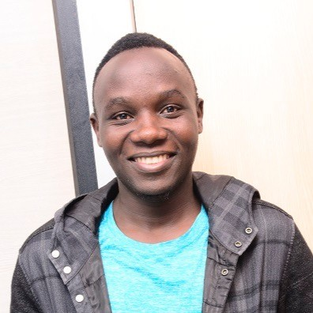

<section class="site-hero">

<h1 class="hero-name">Eric Peter Wairagala</h1>

ML Engineer &middot; NLP Researcher &middot; African Language AI

  I study machine learning systems for <strong>low-resource African languages</strong> —
  building tools that work for the speakers AI has largely left behind. My research spans
  machine translation, named entity recognition, gender bias detection, and explainable NLP,
  with a focus on Luganda and Bantu language families.

  I have contributed to landmark African NLP benchmarks including
  <a href="https://direct.mit.edu/tacl/article-abstract/doi/10.1162/tacl_a_00416/107614">MasakhaNER</a>
  (TACL) and multilingual translation datasets spanning 15+ languages.
  I am actively seeking a <strong>PhD position</strong> to push this research further.

  <a href="https://www.linkedin.com/in/eric-peter-wairagala" class="hero-link">LinkedIn</a>
  <a href="https://github.com/EricPeter" class="hero-link">GitHub</a>
  <a href="https://scholar.google.com/citations?user=al9kLwwAAAAJ&hl=en" class="hero-link">Scholar</a>
  <a href="mailto:kigaye.ericpeter@gmail.com" class="hero-link">Email</a>
  <a href="Eric_Peter_Wairagala_CV.pdf" class="hero-link hero-link-cv">Download CV ↗</a>

  

</section>

::: {.site-body}

## Research

[Low-resource NLP]{.keyword-tag} [Machine Translation]{.keyword-tag} [Named Entity Recognition]{.keyword-tag} [Gender Bias in MT]{.keyword-tag} [Explainable AI]{.keyword-tag} [African Languages]{.keyword-tag} [Large Language Models]{.keyword-tag} [Responsible AI]{.keyword-tag}

## Selected Work

::: {.pub-card}
[Gender Bias Evaluation in Luganda–English Machine Translation](https://aclanthology.org/2022.amta-research.21/){.pub-title}
::: {.pub-authors}
**E. P. Wairagala**, J. Mukiibi, J. F. Tusubira, C. Babirye, J. Nakatumba-Nabende, A. Katumba, I. Ssenkungu
:::
::: {.pub-meta}
[AMTA 2022]{.venue-badge .venue-amta} [PDF ↗](https://aclanthology.org/2022.amta-research.21v2.pdf){.pub-link}
:::
:::

::: {.pub-card}
[MasakhaNER: Named Entity Recognition for African Languages](https://direct.mit.edu/tacl/article-abstract/doi/10.1162/tacl_a_00416/107614){.pub-title}
::: {.pub-authors}
D. I. Adelani, J. Abbott, G. Neubig, ..., **E. P. Wairagala**, et al.
:::
::: {.pub-meta}
[TACL 2021]{.venue-badge .venue-tacl} [PDF ↗](https://onlinelibrary.wiley.com/doi/epdf/10.1111/ele.13716){.pub-link}
:::
:::

::: {.pub-card}
[A Few Thousand Translations Go A Long Way! Leveraging Pre-trained Models for African News Translation](https://arxiv.org/abs/2205.02022){.pub-title}
::: {.pub-authors}
D. I. Adelani, J. O. Alabi, A. Fan, J. Kreutzer, ..., **E. P. Wairagala**, et al.
:::
::: {.pub-meta}
[Large Consortium]{.venue-badge .venue-large} [PDF ↗](https://arxiv.org/pdf/2205.02022.pdf){.pub-link}
:::
:::

[View all publications →](publications.qmd){.all-pubs-link}

## Contact

Open to PhD opportunities and research collaborations — [kigaye.ericpeter@gmail.com](mailto:kigaye.ericpeter@gmail.com)

:::
